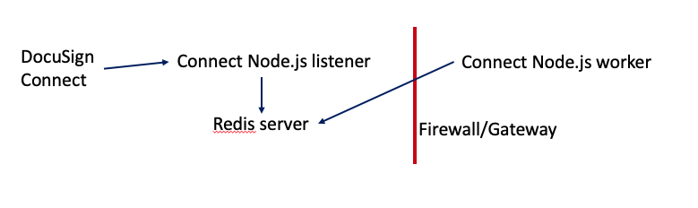

# Connect Node.js Worker (Bee-Queue)

This app creates an example worker daemon
for receiving and processing
DocuSign Connect notification messages
via a [Bee-Queue](https://bee-queue.com/).

The Bee-Queue library uses a [Redis](https://redis.io/)
server to store the queue information.

## Architecture


The diagram shows DocuSign Connect making an
HTTPS POST request to the Node.js Listener.

The listener's port must be available on the public
internet to enable DocuSign connect to reach it.

The listener stores the notification message on 
the Bee-Queue. The Bee-Queue software adds
the message to the Redis server.

Meanwhile, the Connect Node.js worker application
(this repo)
is using the Bee-Queue software to receive
incoming messages from the queue.

The Bee-Queue software creates a TCP channel to the
Redis software. Since the Bee-Queue software on the
worker is *initiating* the connection to the Redis 
server, the worker can be placed behind a 
firewall/gateway system.

### Variations
The listener application can be on the same machine as the 
Redis server, or on a different machine.

The worker machine can be on the public internet.
It can also be on the same machine as the Redis
server.

Bee-Queue supports multiple worker clients.
They will process incoming notifications/jobs
simultaneously. Each incoming notification will be
processed by one worker.

### At least once delivery
The Bee-Queue software, like many reliable 
FIFO libraries, uses an **At least once delivery**
algorithm to ensure that every incoming message
is processed. 

Since there are cases where a message can be 
processed more than once, your message worker
should be designed to be **idempotent.** 
That is, there should be no difference in 
results if a specific message is processed 
once or more than once.

### The worker's task
This worker software implements an idempotent
process for each incoming notification message:

1. **Filtering.** The notification message is checker
   to determine if it should be processed or 
   ignored. 
   
   For this example, the app will  filter out (discard)
   any notifications unless the envelope status is complete
   and has an "Order number" envelope custom field.
1. The envelope's documents are fetched from
   DocuSign as a single **combined** pdf.
1. The document is written as a file to the output directory.

### Idempotent processing
If a duplicate notification message is received, 
then envelope's documents will be fetched a second time
and then stored (with the prior version over-written).

## Installation

The **connect-node-listener-bee-queue** software,
including the Connect configuration and Redis 
server should be
installed first.

### The worker application
This application has been tested with the current version of the
Node.js v8 LTS (Long Term Support) software. It should also
work with later versions of Node.js.

Please report any issues via this repository's issue page.

### Installation steps

#### Operating System
The following steps are used for a Linux / MacOS
system. The **run_worker.sh** command has not yet been
tested on a Windows system.

The  [Git Windows](https://gitforwindows.org/) 
application and its included Windows
Bash shell may be of help for **run_worker.sh** Or 
it could be ported to PowerShell.

Instead of the run-worker.sh command for restarting
the worker, a monitoring system such as 
[pm2](https://github.com/Unitech/pm2),
[forever](https://www.npmjs.com/package/forever),
or similar could be used.

#### Steps
1. Download or clone this repository
1. Move or **cd** to the downloaded directory
1. npm install
1. configure the ds_configuration.js file (see below) or 
   set the environment variables.
1. Do not use npm start. Instead, run **run_worker.sh**

### Configuration
The application is configured in the ds_configuration.js file.

See the file for instructions.

## Operation
After the worker has been started, the server will run by itself.

It is designed to restart itself if too many network errors are 
received.

### Testing

#### Long term tests
1. cd connect-node-worker-bee-queue/tests
1. ./tests.js few    # One test set of five messages is sent per hour 
1. ./tests.js many   # Five tests are sent and then checked. Then repeat asap.

Each test runs for 8 hours.

#### Break test
Set the `ds_configuration.js` value `enableBreakTest` to `true`

Then send a test message that include `/break` as part of the test value. Eg:

````
curl -X POST dslistener.example.com/docusign-listener?test=/break
````

This will cause the worker to raise an exception while processing the 
test message. 

Since the message has not been completely processed, when the worker
restarts (which should happen automatically), the worker will again
attempt to process the test and raise the exception again.

To break the cycle, set the `enableBreakTest` configuration value to `false`
or use Redis tools to clear the Redis db.

## License
MIT License. See the LICENSE file.

## Contributing, issues, etc

Contributions are welcomed. Please submit a pull request.

Bug reports: please use the Issues page of this repository.

General questions about the software: please submit your question to 
StackOverflow and use the 'docusignapi' tag. We monitor the
tag. StackOverflow is the fastest way to have your questions 
answered.

